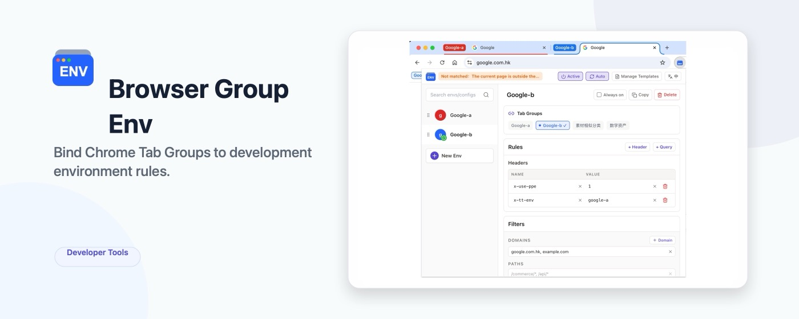

# Browser Group Env

[English](./README.md)

Browser Group Env 是一个 Chrome 扩展，用于把开发环境规则绑定到 Chrome 标签组。

它适合需要同时处理多个任务、分支或预览环境的开发场景：你可以继续使用同一个 Chrome Profile 和登录态，同时用标签组隔离不同环境的请求规则。



## 功能

- 创建和编辑环境配置。
- 将环境绑定到一个或多个 Chrome 标签组。
- 将环境设置为始终生效，不依赖标签组。
- 通过明确的过滤条件限定规则生效范围。
- 通过 Chrome Declarative Net Request 规则添加请求头。
- 通过 Chrome Declarative Net Request 规则替换查询参数。
- 管理可复用的配置模板。
- 应用模板时，支持用 XPath 或 CSS selector 从当前页面读取请求头值。
- 在 popup 和工具栏图标中展示已启用、已暂停、已命中和未命中状态。

## 当前支持的过滤条件

过滤条件用于限制一个环境可以在哪些请求上生效。

- 域名：例如 `app.example.com`。
- 通配子域名：例如 `*.example.com`。
- 路径：可选，例如 `/commerce/*` 或 `/api/*`。
- 排除域名：即使命中域名列表，也不会在这些域名上生效。

没有域名过滤条件的环境不允许注入规则，避免请求头或查询参数被错误打到无关网站。

## 当前支持的规则

Browser Group Env 当前支持两类规则：

- 请求头：为命中的请求添加或替换请求头。
- 查询参数：参数已存在时替换，参数不存在时新增。

规则会以 Chrome Declarative Net Request session rules 的形式安装，并同时受标签组绑定、全局启用状态、环境状态和过滤条件限制。

## 使用 Release 包

1. 从 GitHub Releases 下载 `browser-group-env-<version>-chrome.zip`。
2. 将 zip 解压到本地目录。
3. 打开 `chrome://extensions`。
4. 开启开发者模式。
5. 点击“加载已解压的扩展程序”。
6. 选择解压后的目录。

## 本地开发

```bash
npm install
npm run dev
```

构建可加载到 Chrome 的扩展产物：

```bash
npm run build
```

构建结果会输出到 `output/chrome-mv3`。

## 发布 Zip

GitHub Releases 应上传构建后的 zip 文件，让用户可以直接下载使用，而不是要求用户克隆仓库后自行构建。

```bash
npm run release
```

发布包会输出到 `output/browser-group-env-<version>-chrome.zip`。

## 测试

```bash
npm run typecheck
npm test
```

## 在 Chrome 中加载

1. 执行 `npm run build`。
2. 打开 `chrome://extensions`。
3. 开启开发者模式。
4. 点击“加载已解压的扩展程序”。
5. 选择 `output/chrome-mv3`。

## 许可证

MIT
